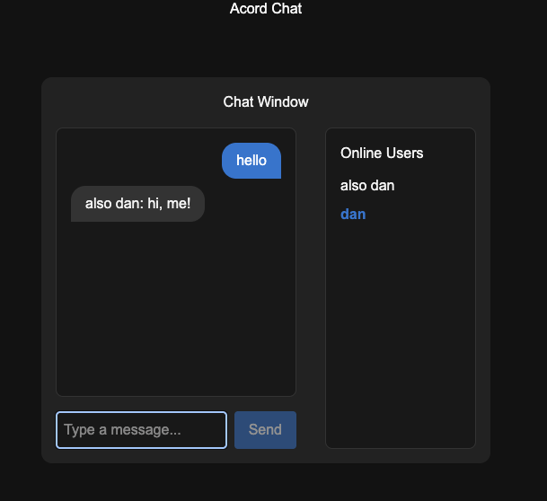

# Acord Project

This repository contains a full-stack application with a SvelteKit frontend and ASP.NET Core backend, containerized using Docker and orchestrated with Docker Compose.



## Project Structure

```
Acord/
├── backend/
│   ├── Acord.Api.sln
│   ├── Dockerfile
│   └── Acord.Api/
│       ├── Acord.Api.csproj
│       ├── Program.cs
│       └── ...
├── frontend/
│   ├── Dockerfile
│   ├── package.json
│   ├── svelte.config.js
│   ├── src/
│   │   └── ...
│   └── ...
├── docker-compose.yml
└── README.md
```

## Prerequisites
- Docker & Docker Compose
- Node.js (for local frontend development)
- .NET 9 SDK (for local backend development)

## Running the Project

### With Docker Compose

1. Build and start all services:
   ```sh
   docker compose up --build -d
   ```
2. Access the frontend at `http://localhost:5173` (default port).
3. The backend API will be available at its configured port (see `docker-compose.yml`).

### Local Development

#### Frontend
1. Install dependencies:
   ```sh
   cd frontend
   npm install
   ```
2. Start the dev server:
   ```sh
   npm run dev
   ```

#### Backend
1. Open the solution in your IDE (e.g., Rider, VS Code).
2. Run the API project (`Acord.Api`).

## Configuration
- Frontend config: `frontend/svelte.config.js`, `frontend/vite.config.ts`
- Backend config: `backend/Acord.Api/appsettings.json`
- Docker Compose: `docker-compose.yml`

## Troubleshooting
- If you see errors about missing native modules (e.g., Rollup), rebuild the Docker image after removing `package-lock.json` and `node_modules`.
- For more details, see the related npm issue: https://github.com/npm/cli/issues/4828

## License
Specify your license here.
